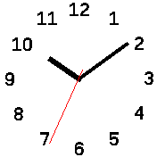

# banglejs-2-twelve-fold-clock-face #

a simple clock face with numbers 1...12 for analog clocks on a Bangle.js 2

This module draws a face with the numbers 1-12 (optionally surrounded by dots for every minute) for an analog clock running on a [Bangle.js 2](https://www.espruino.com/Bangle.js2).

<table>
 <tr valign="top">
   <td align="center"><br>without dots</td>
   <td align="center"><br>with Dots</td>
 </tr>
</table>

## Usage ##

Within a clock implementation, the module may be used as follows:

```
let Clockwork = require(...);
Clockwork.windUp({
  face:require('https://raw.githubusercontent.com/rozek/banglejs-2-twelve-fold-clock-face/main/ClockFace.js'),
  ...
}, { withDots:true });
```

`Settings.withDots` controls whether surrounding dots are drawn or not: if set to `true`, they are drawn otherwise not.

## Example ##

The following code shows a complete example for a (still simple) analog clock using this clock face:

```
let Clockwork = require('https://raw.githubusercontent.com/rozek/banglejs-2-simple-clockwork/main/Clockwork.js');

Clockwork.windUp({
  face: require('https://raw.githubusercontent.com/rozek/banglejs-2-twelve-fold-clock-face/main/ClockFace.js'),
  hands:require('https://raw.githubusercontent.com/rozek/banglejs-2-simple-clock-hands/main/ClockHands.js'),
},{
  Foreground:'#000000', Background:'#FFFFFF', Seconds:'#FF0000'
});
```

## License ##

[MIT License](LICENSE.md)
